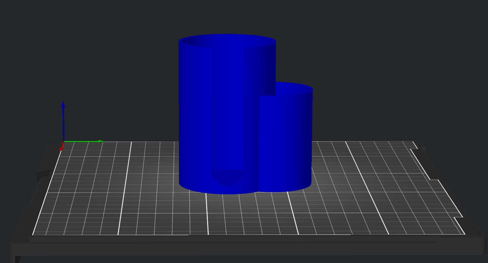
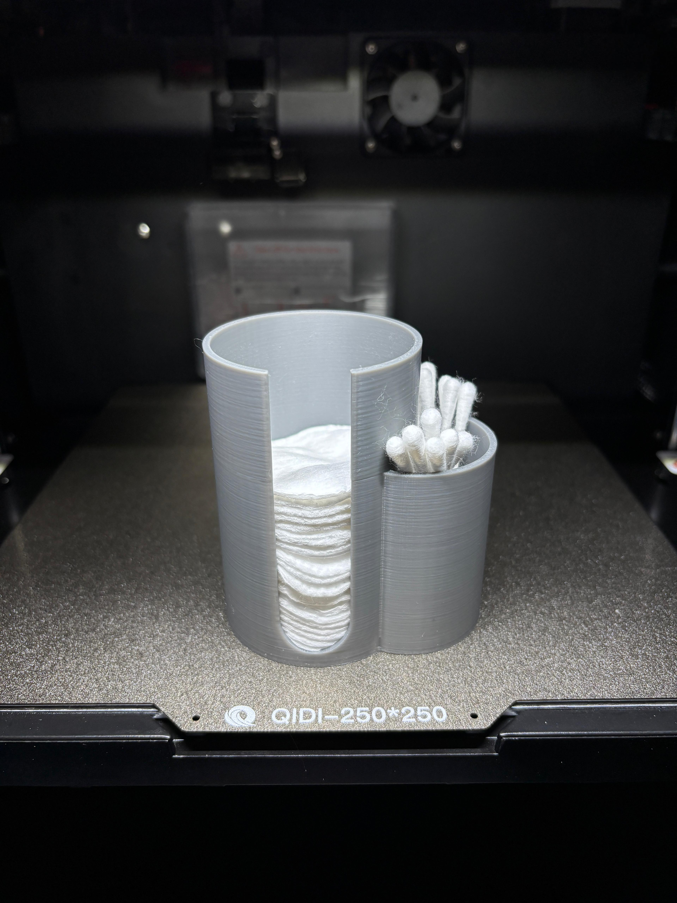

# Sanitary Station

Holds cotton pads and cotton swaps neatly in place.

I printed it in Sunlu PLA+, 0.2mm, 10% infill.
It takes about 1h20m to print and uses 54g of filament.

# Render in Qidi Slicer

# Photo of the printed part

